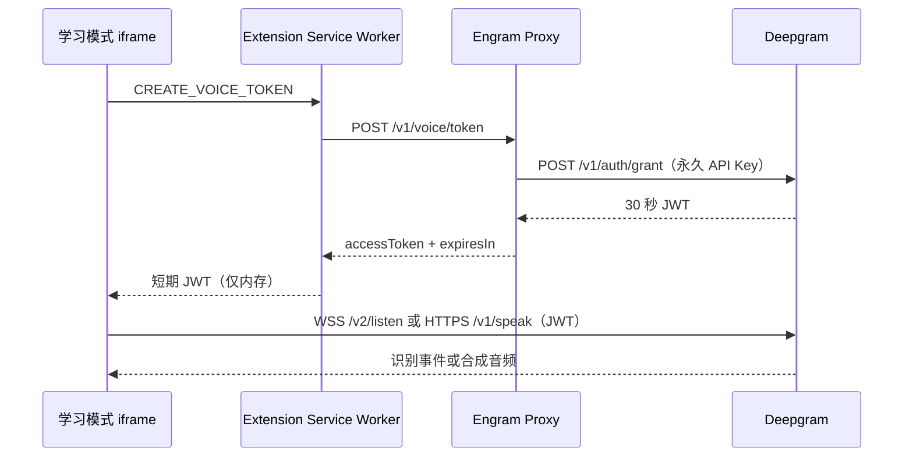

# Engram 讨论语音输入与文字转语音 Spec

> 状态：Approved，已确认供应商与默认模型，等待按本 Spec 开发
> 日期：2026-08-19
> 范围：仅定义产品、交互、服务协议和验收标准，本阶段不开发
> 关联文档：[学习模式产品与交互 Spec](./learning-mode-spec.md)

## 1. 背景与问题

当前讨论课只支持文字输入和文字回复。用户需要阅读 AI 问题、键盘输入答案，再阅读 AI 反馈，交互更像聊天，而不是和英语老师对话；这也让用户更容易把注意力放在拼写和编辑上，弱化即时组织语言与听说练习。

本能力要让用户可以：

1. 直接说出英文答案，并在发送前看到、修改识别文本；
2. 自动听到自然的 AI 英语老师语音；
3. 随时在语音和文字之间切换，语音服务不可用时仍能完成讨论。

本 Spec 覆盖主 Spec“首版暂不支持语音输入”的限制；其他讨论状态机、提纲顺序、字幕引用和文字会话协议保持不变。

## 2. 已确认的产品决策

### 2.1 供应商与模型

首版只集成 **Deepgram**，不同时配置多家语音供应商：

- STT：Deepgram Flux English，模型 `flux-general-en`，通过 `/v2/listen` WebSocket 流式识别；
- TTS：Deepgram Aura-2，默认声音 `aura-2-thalia-en`，通过 `/v1/speak` 合成；
- 识别语言固定为英语；首版不承诺中文或中英混说质量；
- TTS 默认语速 `1.0`，首版不提供声音和语速选择器；
- OpenAI、ElevenLabs、Azure 保留为以后重新盲测的候选，不进入首版代码和配置。

选择依据是无集成试听中 Deepgram 与 Azure 均进入偏好组，Deepgram 略占优；Deepgram 又能用同一账号和密钥覆盖 Flux STT 与 Aura-2 TTS，因此首版只需管理一套语音供应商配置。

### 2.2 密钥与调用原则

- 只新增一个服务端 Secret：`DEEPGRAM_API_KEY`；
- 永久 API Key 只存在于 Engram 后端环境变量或 Cloudflare Worker Secret；
- 扩展源码、Manifest、构建产物、`chrome.storage` 和日志中都不得出现永久 API Key；
- 客户端每次建立语音请求前，通过 Engram 代理获取 Deepgram 短期 JWT；JWT 默认有效期为 30 秒，只保存在内存中；
- 客户端使用短期 JWT 直接连接 Deepgram，Engram 代理不转发原始录音，也不转发需朗读的正文；
- STT、TTS 请求都设置 `mip_opt_out=true`，不参加 Deepgram Model Improvement Program；
- 不使用 Web Speech API 作为静默备用，以免同一产品在不同机器上出现不可预测的识别质量和声音差异；Deepgram 不可用时降级为现有文字讨论。

### 2.3 交互原则

- 语音识别只负责生成草稿，**永不自动发送**；
- AI 新消息默认自动朗读，用户可持久关闭；
- 用户点击麦克风、播放视频或手动朗读另一条消息时，立即停止当前 AI 朗读；
- 首版是按轮次的“说完—检查—发送—听回复”，不是实时双工电话。

## 3. 目标与非目标

### 目标

- 用户点击一次麦克风即可开始说英文，再次点击后获得可编辑文本；
- 录音过程中显示持续更新的临时识别文本；
- AI 新回复默认使用自然英语声音朗读，可停止、重播；
- 录音、AI 朗读和左侧视频声音互斥，避免回声和注意力冲突；
- 权限拒绝、网络失败、额度不足和供应商异常都有明确反馈，文字讨论不受影响；
- 不改变现有讨论轮次、AI Prompt、消息上限、字幕证据和课程完成规则；
- 桌面最窄 300px 学习面板和 390px 移动宽度下均可操作。

### 非目标

- 实时双工、自动抢话、免点击连续监听、唤醒词或后台监听；
- 自动发送识别结果；
- 发音评分、口音判断、音素级纠错或用户录音回放；
- 多供应商路由、自动切换供应商或用户自带 API Key；
- 使用 Deepgram Voice Agent API 托管整段对话；
- 保存录音、导出音频或跨设备同步合成音频；
- 声音角色、口音、语速、麦克风设备和降噪参数设置；
- 离线语音、Web Speech 回退以及 Firefox、Safari 支持承诺。

## 4. 核心用户流程

### 4.1 开始讨论

1. 用户点击“开始讨论”；
2. 客户端暂停左侧视频，但不在讨论结束后自动恢复；
3. 第一条 AI 问题正常显示；
4. “自动朗读”默认开启时，客户端获取短期令牌并朗读第一条问题；
5. 用户可点击麦克风回答，也可直接键盘输入。

进入讨论不立即请求麦克风权限。只有用户第一次点击麦克风时才展示隐私说明并请求权限。

### 4.2 首次语音使用

首次点击麦克风时展示一次说明：

> 为识别你的英语回答，录音会直接发送给 Deepgram 处理；Engram 不保存录音。你可以在发送前修改识别结果，也可以继续打字回答。

用户确认后才调用 `getUserMedia()`。说明是否已展示可记录为本地布尔值，但不能替代浏览器麦克风授权。用户取消说明或拒绝授权时保留原有草稿，不请求语音令牌。

### 4.3 语音回答

1. 用户点击输入框内的麦克风按钮；
2. 若 AI 正在朗读则立即停止；若视频正在播放则暂停视频；
3. 获取麦克风权限并打开音轨；
4. 通过现有 Engram 代理申请一个短期 Deepgram JWT；
5. 建立 Flux WebSocket，连接成功后状态变为“正在听，请用英文回答…”；
6. 临时识别结果实时显示在输入框中，但不进入消息历史；
7. Flux 返回一个 `EndOfTurn` 时，把该段转为已确认文本并继续监听，允许一句回答中自然停顿；
8. 用户再次点击麦克风或达到 120 秒上限时停止采集，发送 `CloseStream` 并等待最后结果；
9. 最终文本留在输入框中，状态变为“已识别，可编辑后发送”；
10. 用户修改文本并点击现有发送按钮后，才正式提交给 AI 老师。

如果输入框在录音前已有文字，识别结果追加到当前光标位置，并自动处理英文空格；不得覆盖用户原稿。识别过程中输入框只读，停止后恢复编辑。最终内容仍受现有 1,200 字符上限约束，超出部分不写入并提示用户。

### 4.4 AI 朗读

- “自动朗读”开启时，每次新增 AI 主消息后朗读该消息正文；
- 问题、反馈、提示和课堂总结属于可朗读正文；
- 不朗读“AI 老师”角色标签、字幕时间戳、引用按钮和独立 `feedback-note`；
- AI 一条消息同时包含反馈和下一题时，按界面正文顺序朗读；
- 每条 AI 消息角色标签旁显示朗读按钮：空闲时为“朗读这条回复”，朗读当前消息时为“停止朗读”；
- 同一时刻最多一个朗读任务；新任务开始前取消旧请求和播放器；
- 用户点击麦克风、播放左侧视频、切换离开讨论 Tab、完成或重置讨论、页面隐藏时，立即停止朗读；
- 同一条未变化的 AI 消息在当前讨论内重播时优先使用内存音频缓存，不重复计费；
- 朗读失败只显示轻量错误，不重发 AI 请求，也不影响文字内容。

单次 Aura-2 请求最多接受 2,000 字符。客户端按英文句子边界把超长正文切成不超过 1,800 字符的片段，顺序合成和播放，避免在单词中间切断。

### 4.5 视频声音协调

- 开始讨论时暂停视频；
- 开始识别或朗读前再次确保视频已暂停；
- 用户在识别期间主动播放视频时，停止识别并保留已获得的最终文本；
- 用户在朗读期间主动播放视频时，停止朗读；
- 系统不自动恢复视频，避免讨论中突然出现背景声。

## 5. 界面规格

### 5.1 Composer

现有输入区增加自动朗读开关和麦克风按钮：

```text
[🔊 自动朗读：开]                              [给我提示]
┌─────────────────────────────────────────────────────┐
│ 用英文回答…                            [🎙] [发送] │
└─────────────────────────────────────────────────────┘
  正在听，请用英文回答…                         00:18
```

- “自动朗读”与“给我提示”位于输入框上方同一操作行；
- 麦克风按钮位于发送按钮左侧，两个按钮均为 34×34px；
- 输入框右侧为两个按钮预留空间，文字不得被遮挡；
- 录音态使用琥珀色实心或描边，并同时显示“正在听”和已录时长，不只靠颜色表达；
- 录音态可使用轻微脉冲动画，但必须尊重 `prefers-reduced-motion`；
- 输入区下方保留固定高度状态区域，避免布局跳动；
- 自动朗读开关使用 button 或 checkbox 语义，必须有可见文字。

### 5.2 AI 消息

```text
AI 老师                                      [🔊]
┌─────────────────────────────────────────────────────┐
│ What is your number one bucket list destination?   │
└─────────────────────────────────────────────────────┘
```

- 扬声器按钮点击热区至少 28×28px；
- 正在加载时显示进度态，正在朗读时显示停止图标和 `aria-pressed="true"`；
- 用户消息不提供朗读按钮；
- 自动朗读关闭时，单条消息朗读按钮仍可使用。

### 5.3 状态文案与可访问性

| 状态 | 可见文案 | 麦克风 `aria-label` |
| --- | --- | --- |
| 空闲 | 空 | 语音回答 |
| 请求权限 | 正在请求麦克风权限… | 正在请求麦克风权限 |
| 连接中 | 正在连接语音服务… | 正在连接语音服务 |
| 录音中 | 正在听，请用英文回答… | 停止语音输入 |
| 收尾中 | 正在完成识别… | 正在完成语音识别 |
| 已完成 | 已识别，可编辑后发送 | 重新语音回答 |
| 未听到语音 | 没有听清，请再试一次 | 重新语音回答 |
| 权限拒绝 | 麦克风未授权，请在浏览器设置中允许 | 麦克风未授权 |
| 服务不可用 | 语音服务暂时不可用，可继续打字 | 重新语音回答 |
| 达到上限 | 本次语音练习已达到用量上限，可继续打字 | 语音用量已达上限 |

状态区使用 `aria-live="polite"`，但临时识别文本变化不逐字播报，避免屏幕阅读器噪声。所有控制支持键盘操作和清晰的 `:focus-visible` 样式。

## 6. 状态模型与并发规则

### 6.1 输入状态

`voiceInputState` 只能为：

```text
unavailable → idle → requesting_permission → connecting → listening → finalizing → idle
                                         ↘ error ─────────────────────────────→ idle
```

- `unavailable`：缺少麦克风、MediaRecorder 或网络能力；
- `requesting_permission`：等待用户确认和浏览器授权；
- `connecting`：申请短期令牌并建立 Flux WebSocket；
- `listening`：持续发送音频并接收临时或分段最终文本；
- `finalizing`：已停止采集，等待 `CloseStream` 后最后结果；
- `error`：显示稳定错误后可重试，不清空已有输入。

单次语音输入最长 120 秒。页面 `hidden`、`pagehide`、讨论重置或扩展上下文失效时，立即停止 MediaRecorder、关闭 WebSocket、停止所有音轨；已有最终文本保留，未确认的临时结果不保留。

### 6.2 输出状态

`speechOutputState` 只能为：

```text
unavailable | disabled | idle | loading | speaking | error
```

“自动朗读”是用户偏好，不等于服务可用性。自动朗读关闭时状态为 `disabled`，用户单条重播期间仍可进入 `loading` 和 `speaking`。

### 6.3 互斥规则

用户新触发的录音或视频播放覆盖旧音频动作，AI 自动朗读优先级最低。

| 新动作 | 当前识别中 | 当前朗读中 | 当前 AI 请求中 |
| --- | --- | --- | --- |
| 点击麦克风 | 停止并收尾 | 先停止朗读，再开始识别 | 禁用，不允许开始 |
| 播放视频 | 停止并保留最终文本 | 停止朗读 | 允许，AI 请求继续 |
| 单条朗读 | 禁用 | 切换到所选消息 | 允许朗读已有消息 |
| 发送答案 | 先完成识别后才可发送 | 停止朗读 | 已禁用，避免重复提交 |
| 获取新 AI 消息 | 不应同时发生 | 停止旧朗读并朗读新消息 | 请求结束 |

讨论输入框、发送按钮、“给我提示”和麦克风按钮在 AI 请求期间统一禁用；请求结束后按讨论是否完成恢复。

## 7. 技术架构

### 7.1 数据流



永久密钥只经过 `Engram Proxy → Deepgram /auth/grant`。原始麦克风音频和需朗读的 AI 正文直接在扩展与 Deepgram 之间传输，不经过 Engram 代理。

### 7.2 服务端令牌接口

新增：

```http
POST /v1/voice/token
Origin: chrome-extension://<extension-id>
```

成功响应：

```json
{
  "accessToken": "<short-lived-jwt>",
  "expiresIn": 30
}
```

约束：

- 请求体为空；客户端不能传项目、权限、模型、TTL 或 Deepgram URL；
- 后端固定调用 `https://api.deepgram.com/v1/auth/grant`，默认 TTL 30 秒；
- 上游鉴权使用服务端 `DEEPGRAM_API_KEY`；该 Key 需要满足 Deepgram 生成临时令牌所需的权限；
- 响应设置 `Cache-Control: no-store`，代理和客户端均不得落盘缓存；
- 只返回短期 JWT、过期秒数和稳定错误，不透传上游详细错误；
- 沿用现有允许来源校验，并为该路由设置独立限流：默认每 IP 每分钟 12 次、突发 4 次；
- 生产公开给多用户前，必须增加 Engram 用户身份或安装级短期凭证。`Origin` 白名单只能减少浏览器误用，不能作为公开 API 的唯一身份认证；
- 日志只记录路由、状态码、耗时和 Deepgram request id，不记录 JWT、Authorization header、请求正文或语音内容。

本地与生产环境新增同名 Secret：

```dotenv
DEEPGRAM_API_KEY=...
```

实现时同步更新 `server/.env.example`、本地 env 解析、`server/wrangler.jsonc`、部署工作流和后端测试。Key 轮换不得要求重新打包扩展。

### 7.3 客户端令牌生命周期

- 令牌只在即将建立 STT WebSocket 或发起 TTS 请求时申请；
- 不预取、不写入 `chrome.storage`、IndexedDB、URL、DOM 或错误日志；
- STT 与 TTS 各自申请新令牌，不跨请求复用；
- 收到令牌后 10 秒内必须发起 Deepgram 请求，否则丢弃并重新申请；
- WebSocket 建立后可继续使用到本次录音结束，不因 JWT 过期主动断开；
- 任何鉴权失败只允许自动刷新并重试一次，避免令牌接口循环调用。

### 7.4 STT 传输与事件

客户端建立：

```text
wss://api.deepgram.com/v2/listen
  ?model=flux-general-en
  &mip_opt_out=true
```

浏览器 WebSocket 不能设置任意 Authorization header，因此使用 Deepgram 支持的 `Sec-WebSocket-Protocol` 方式建立连接：`new WebSocket(url, ["bearer", accessToken])`；不得在查询参数中携带令牌。

音频采集首选 Chrome 原生 `MediaRecorder`：

- `getUserMedia({ audio: { channelCount: 1, echoCancellation: true, noiseSuppression: true, autoGainControl: true } })`；
- MIME 为 `audio/webm;codecs=opus`，按约 80ms 产生一个 chunk；
- WebM/Opus 属于 Flux 支持的容器化输入，因此连接 URL 不再声明 `encoding` 和 `sample_rate`；
- 每个非空 chunk 作为二进制 WebSocket frame 发送；
- 若目标 Chrome 环境不支持 WebM/Opus MediaRecorder，本期直接降级文字输入，不引入第二套 PCM 编码器。

事件处理：

- `Update`：更新临时文本，只用于界面预览；
- `StartOfTurn`：只更新录音 UI，不触发自动发送或提前请求 AI；
- `EndOfTurn`：把本段 transcript 追加为已确认文本；
- 不启用 `EagerEndOfTurn`，降低首版状态机复杂度；
- 用户停止时发送 `{ "type": "CloseStream" }`，等待最后 `TurnInfo` 后关闭连接；
- 临时文本、置信度、逐词时间戳不写入讨论历史，也不发送给 DeepSeek。

### 7.5 TTS 请求与播放

客户端使用短期 JWT 发起：

```http
POST https://api.deepgram.com/v1/speak
  ?model=aura-2-thalia-en
  &encoding=mp3
  &speed=1.0
  &mip_opt_out=true
Authorization: Bearer <short-lived-jwt>
Content-Type: application/json

{ "text": "What is your number one bucket list destination?" }
```

- 模型、声音、语速和隐私参数由客户端常量固定，不接受 AI 回复或页面内容覆盖；
- 使用 `AbortController` 取消不再需要的合成请求；
- 播放层消费 Deepgram 返回的 MP3。可流式播放时尽早开始，同时收集字节用于重播缓存；不支持流式播放时回退为完整 Blob 后播放；
- 当前讨论内按 `文本哈希 + voice + speed` 缓存 Blob/Object URL，重播不重新请求；
- 缓存只在内存中，最大 20MB；超过上限按最久未使用顺序回收；
- 讨论重置、页面关闭或扩展上下文失效时停止播放器并撤销所有 Object URL；
- 自动朗读和手动重播都计入同一会话 TTS 字符预算。

### 7.6 扩展边界与权限

建议新增两个独立、可测试的模块：

- `src/discussion-stt.js`：麦克风、MediaRecorder、Flux WebSocket、事件归并和清理；
- `src/discussion-tts.js`：分段、令牌、合成、缓存、播放和取消。

`learning-mode.js` 只负责将状态接入现有讨论 UI、消息列表和视频互斥；服务端令牌请求继续通过 `chrome.runtime.sendMessage` 交给 `src/service-worker.js`，不把代理调用散落到 iframe。

实现时需要：

- 将学习面板 iframe 的 `allow="clipboard-write"` 扩展为 `allow="clipboard-write; microphone"`；
- 在 Manifest 的 `host_permissions` 和 extension page CSP 中精确加入 Deepgram HTTPS/WSS 连接所需来源；
- 将新模块加入白名单构建和 `web_accessible_resources`；
- 不新增宽泛的 Manifest `audioCapture`、`contentSettings` 或 `<all_urls>` 权限；
- 必须在真实 YouTube 学习模式的跨源扩展 iframe 中验证权限，不能只测试 `preview=1` 顶层页面。

### 7.7 设置与预览模式

新增 `discussionAutoSpeak` 布尔设置，存入 `chrome.storage.sync`：

- 新用户默认 `true`；
- 切换后立即生效并持久化；
- 从 `true` 切到 `false` 时立即停止当前朗读；
- 设置读取失败时只在当前会话使用默认值，不阻塞讨论。

麦克风权限、JWT、录音、转写结果、声音对象和音频缓存不写入扩展存储。

`learning-mode.html?preview=1` 不请求权限、不申请令牌、不访问 Deepgram：

- 点击麦克风后按固定时序演示 `connecting → listening → finalizing → idle`；
- 写入固定英文示例，不自动发送；
- 点击朗读只演示 `loading → speaking → idle`；
- 自动化截图和交互测试不产生真实声音或网络费用。

## 8. 隐私与安全

### 8.1 数据分类

| 数据 | 去向 | 保存策略 |
| --- | --- | --- |
| 原始麦克风音频 | 扩展直传 Deepgram STT | Engram 不保存；请求使用 `mip_opt_out=true` |
| 临时识别文本 | Deepgram 返回扩展 | 仅内存，不进入消息历史和日志 |
| 用户确认后的回答 | 现有 Engram/DeepSeek 讨论链路 | 沿用现有文字讨论规则 |
| AI 朗读正文 | 扩展直传 Deepgram TTS | Engram 代理不接收；请求使用 `mip_opt_out=true` |
| 合成音频 | Deepgram 返回扩展 | 当前页面内存缓存，退出后清除 |
| 短期 JWT | Engram 代理返回扩展 | 仅内存，不缓存、不记录 |

### 8.2 强制要求

- 麦克风只在用户明确点击后启动，按钮停止后立即释放所有音轨；
- 权限说明必须明确第三方 Deepgram 会处理音频和朗读文本；
- 所有语音请求使用 TLS；永久 Key 不进入客户端；
- 错误日志不得包含口述内容、AI 正文、JWT、Authorization header、音频字节或麦克风设备名称；
- 使用 `mip_opt_out=true`；根据 Deepgram 当前说明，退出该计划的请求数据只保留完成处理所需时间；
- 字幕、AI 回复和网页内容均不得改变语音权限、模型、端点、令牌或自动监听规则；
- 公开发布前完成 Chrome Web Store 隐私披露，说明语音数据传给 Deepgram 的目的和处理方式。

## 9. 用量与成本控制

以下为 2026-08-19 Deepgram Pay As You Go 公价快照，开发和上线前必须重新核对：

| 能力 | 单价 |
| --- | ---: |
| Flux English Streaming STT | 当前促销价 $0.0065/分钟；页面同时标示常规价 $0.0077/分钟 |
| Aura-2 TTS | $0.030/1,000 字符 |

估算公式：

```text
单课语音成本 = STT 分钟 × 0.0065 + TTS 字符数 ÷ 1000 × 0.030
```

典型一节 15 分钟讨论，若用户实际说 6 分钟、AI 共朗读 3,600 字符：

```text
STT  $0.039
TTS  $0.108
合计 $0.147 / 课
```

约 1,000 节同等用量为 $147，不包含 DeepSeek 文字讨论成本。免费额度不计入产品预算模型。

首版限制：

- 单次录音最多 120 秒；
- 单次讨论累计 STT 最多 15 分钟；
- 单次讨论累计 TTS 最多 12,000 字符；
- 达到上限后停止对应语音能力，保留完整文字讨论；
- 同一时间最多一个 STT 连接、一个 TTS 请求，且二者不并发运行；
- 同一消息重播使用内存缓存；
- 令牌接口独立限流，Deepgram 项目配置月度预算提醒；
- 客户端统计本次会话使用的录音秒数和 TTS 字符数，但不统计内容。

由于短期 JWT 允许客户端直连供应商，客户端限额不能替代服务端身份与供应商预算控制。多人公开发布前，用户鉴权与可撤销配额是阻断项。

## 10. 错误与降级

| 场景 | 用户反馈 | 降级行为 |
| --- | --- | --- |
| 麦克风被 iframe 策略阻止 | 当前页面无法使用麦克风，可继续打字 | 不重复请求；保留草稿 |
| 用户拒绝权限 | 麦克风未授权，请在浏览器设置中允许 | 不清空草稿；继续打字 |
| 无麦克风或 MediaRecorder | 当前设备不支持语音输入 | 隐藏或禁用麦克风；文字讨论可用 |
| 令牌接口未配置 Key | 语音服务尚未配置，可继续打字 | 不直连 Deepgram；文字讨论可用 |
| 令牌过期或鉴权失败 | 正在重新连接语音服务… | 自动刷新并重试一次，仍失败则降级 |
| Flux 连接失败或中断 | 语音识别暂时不可用，请稍后再试 | 保留已确认文本；释放麦克风 |
| 没有检测到语音 | 没有听清，请再试一次 | 回到空闲；不发送空消息 |
| 120 秒到时 | 已停止录音，可编辑后发送 | 完成收尾并保留最终文本 |
| 达到会话预算 | 本次语音练习已达到用量上限 | 停止对应语音；文字讨论可用 |
| Aura-2 限流、额度不足或失败 | 朗读暂时不可用，可稍后重试 | 文本正常显示；不重发 AI 请求 |
| TTS 播放被浏览器阻止 | 点击扬声器即可播放 | 保留手动朗读按钮 |

主动停止、页面隐藏或用户切换动作不显示红色错误。错误码对用户保持稳定，不直接暴露供应商响应正文。

## 11. 监测指标

只记录不含内容的聚合事件；若项目尚无遥测基础设施，则保留事件接口而不发送到外部：

- `voice_input_started`；
- `voice_input_connected` + 连接耗时；
- `voice_input_completed` + 时长区间；
- `voice_input_failed` + 稳定错误码；
- `voice_input_sent`；
- `tts_auto_started` / `tts_replay_started`；
- `tts_first_audio` + 首音耗时；
- `tts_cache_hit`；
- `tts_stopped` / `tts_failed`；
- 语音讨论完成率与纯文字讨论完成率。

不得记录识别文本、AI 回复、录音、JWT、声音名称、置信度或权限设置详情。

## 12. 测试策略

### 12.1 自动化

- STT 模块用假 MediaRecorder、假 WebSocket 覆盖连接、`Update`、多个 `EndOfTurn`、`CloseStream`、超时、主动取消和错误；
- TTS 模块用假 fetch/播放器覆盖分段、自动朗读、缓存命中、重播、切换消息、取消、失败和内存回收；
- 令牌接口测试缺少 Key、上游鉴权、`no-store`、来源校验、限流和日志脱敏；
- service worker 测试保证永久 Key 不进入任何客户端请求或响应；
- UI 测试验证麦克风、自动朗读、单条朗读、ARIA、禁用态、计时和状态文案；
- 状态机测试验证识别、视频、朗读和 AI 请求不会重叠；
- 预览模式测试验证不调用真实权限、令牌接口或 Deepgram；
- 构建测试验证新模块进入扩展产物，Secret 和测试文件不进入扩展包。

### 12.2 手工与真机验收

- 在真实 YouTube 学习页的扩展 iframe 中完成首次授权；
- 验证允许、拒绝、永久阻止、无麦克风和权限被父页面策略阻止；
- 验证 A2–C1 非母语口音、短回答、长停顿、背景噪声、空白录音和接近 1,200 字符上限；
- 验证 AI 自动朗读、手动停止、重播缓存、超长消息分段和关闭自动朗读；
- 验证录音/朗读期间播放视频的互斥行为；
- 验证断网、慢网、401、429、5xx、余额不足和令牌过期；
- 验证 300px 可调整面板、1440×900 桌面和 390px 移动布局；
- 验证页面隐藏、刷新、退出学习模式和扩展重载后麦克风立即释放；
- 用 Chrome Network 与后端日志确认永久 API Key、JWT、音频和正文未被错误记录。

## 13. 验收标准

### 功能

- Chrome 目标版本中，用户能通过麦克风生成英文文本、编辑并手动发送；
- 语音识别永不自动发送答案；
- 自动朗读默认开启且可持久关闭；
- 每条 AI 消息可单独朗读、停止和重播；
- 同一时间不会同时录音、播放 AI 朗读和播放视频声音；
- AI 请求期间不能重复发送、开始录音或触发提示请求；
- 语音服务不可用或达到用量上限时，文字讨论全过程可完成；
- 讨论完成后所有语音采集、网络连接和播放器都已停止；
- 预览模式无需权限、网络、Key 或真实声音即可走通视觉状态。

### 安全与隐私

- 扩展源码、构建产物、存储和网络 URL 中没有 `DEEPGRAM_API_KEY`；
- JWT 仅在内存和授权请求头/子协议中短暂存在，不进入 URL、存储或日志；
- Engram 代理只处理令牌申请，不接收原始音频和 TTS 正文；
- 所有 STT/TTS 请求带 `mip_opt_out=true`；
- 日志和消息历史中没有原始音频、临时文本、置信度和认证信息；
- 页面隐藏或结束录音后，浏览器麦克风指示在 1 秒内熄灭。

### 体验与质量

- 常规宽带下，点击麦克风到可说话状态 P95 不高于 2 秒；
- 说话期间临时文本持续更新，无明显整段等待；
- 常规宽带下，短 AI 消息请求到开始播放 P95 目标不高于 2.5 秒；
- 30 条覆盖 A2–C1、常见非母语口音的固定验收句中，至少 90% 无需修改或只需修改标点/大小写即可表达原意；
- 键盘、屏幕阅读器和 `prefers-reduced-motion` 场景可用；
- 300px–桌面宽度内无按钮遮挡、输入文字遮挡或状态跳动；
- 根目录与服务器既有测试通过，新增语音测试通过，控制台无相关 error/warn。

## 14. 实施顺序（本 Spec 确认后）

1. 后端增加临时令牌接口、Secret 配置、限流、日志脱敏和测试；
2. 新增可测试的 STT/TTS 模块和预览替身；
3. 增加 iframe 麦克风委派、精确网络权限、Composer 控件和消息朗读按钮；
4. 接入讨论状态机、视频互斥、设置、隐私说明和会话用量限制；
5. 补充自动化测试和扩展构建检查；
6. 在真实 YouTube 学习模式完成权限、网络异常、音频互斥、响应式和语音质量 QA；
7. 更新主学习模式 Spec 与 README，把“AI 文字讨论”改为“AI 文字与语音讨论”。

开发开始前只需准备一项第三方配置：在本地和部署环境创建 `DEEPGRAM_API_KEY`。无需创建 OpenAI、Azure 或 ElevenLabs 语音 Key。

## 15. 技术依据

- [Deepgram Flux Quickstart](https://developers.deepgram.com/docs/flux/quickstart)：Flux 使用 `/v2/listen`、`flux-general-en`，支持 WebM/Opus 容器音频并建议约 80ms 音频块；
- [Deepgram Flux API Reference](https://developers.deepgram.com/reference/speech-to-text/listen-flux)：定义 `TurnInfo`、`Update`、`EndOfTurn`、`CloseStream` 和 `mip_opt_out`；
- [Deepgram Aura TTS Getting Started](https://developers.deepgram.com/docs/text-to-speech)：Aura-2 REST 合成与 `aura-2-thalia-en` 模型示例；
- [Deepgram Token-Based Auth](https://developers.deepgram.com/guides/fundamentals/token-based-authentication)：短期 JWT 默认 30 秒，适用于浏览器直连 Listen/Speak；WebSocket 建立后不要求令牌持续有效；
- [Deepgram Model Improvement Program](https://developers.deepgram.com/docs/the-deepgram-model-improvement-partnership-program)：`mip_opt_out=true` 的数据使用和保留说明；
- [Deepgram 2026-03-05 Changelog](https://developers.deepgram.com/changelog/2026/3/5)：Pay As You Go 与 Growth 客户选择退出 MIP 不影响官网标价；
- [Deepgram Pricing](https://deepgram.com/pricing)：Flux English Streaming 与 Aura-2 的当前 Pay As You Go 单价；
- [Chrome Permissions Policy](https://developer.chrome.com/docs/privacy-security/permissions-policy)：跨源 iframe 使用麦克风需要显式委派，并仍受父页面策略约束；
- [Chrome 扩展隐私建议](https://developer.chrome.com/docs/extensions/develop/security-privacy/user-privacy)：敏感能力应在用户实际启用时请求，并坚持最小权限原则。
